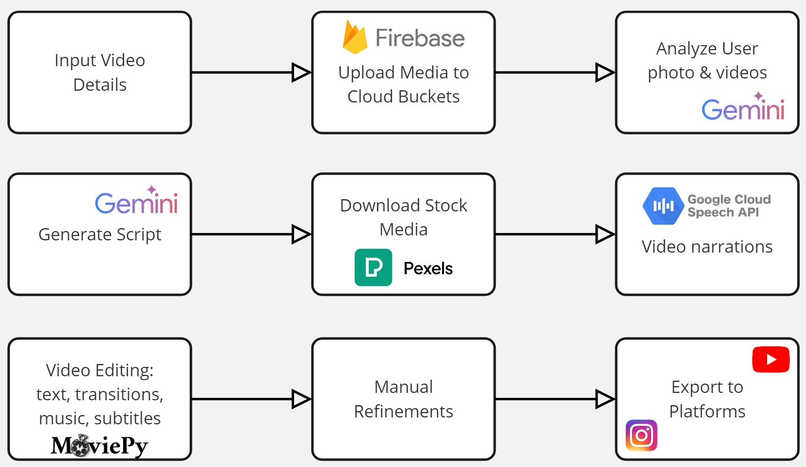

# Clip Craft

👏😊Our app is finally available online for everyone to play around: 

.jpg)

## Our Story

Our app is an AI-driven content creation tool designed for small businesses and individual users, featuring a user-friendly interface. It can create stories from personal photos and search for relevant content on the internet.

Powered by FastAPI and Next.js, our app integrates several Google services, including Google Speech API, Gemini Flash Model, Cloud Run services, and Firebase Buckets. Video editing is facilitated by MoviePy, and we source royalty-free stock from Pexels.

Our versatile application can be used for travel diaries, food vlogs, promotional ads, journalistic content, and explainer videos. Future plans include supporting more integrations, AI artwork generation, and user project libraries to further enhance our product.

## Architecture

Dive into Clip Craft's thinking framework:

## Try our app? 

Clone this repo and explore our app locally. 

1. docker build -t clipcraft .
2. docker run -d -p 8000:8000 clipcraft

If you encounter security policy with image magick, please comment policy.xml in the linux build. 
